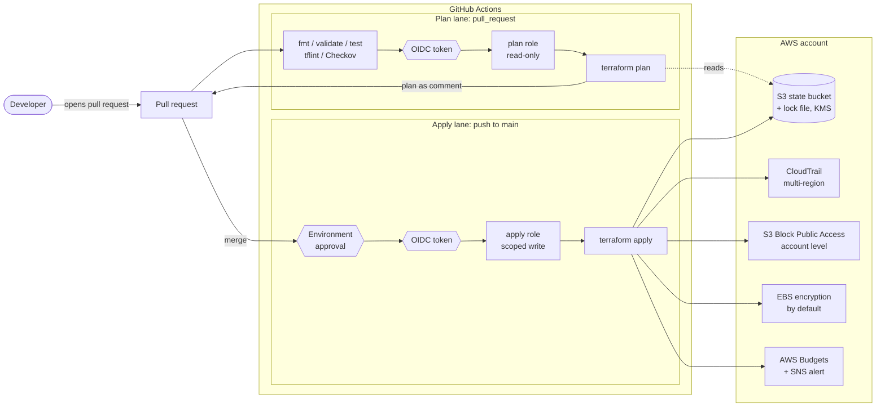

# terraform-aws-baseline-lab

> **Personal lab / demonstration. Not client code.** Every account ID, email and repository name in this repo is a
> placeholder.

A new AWS account often starts with settings made by hand and changes nobody reviews. This lab sets the account
baseline in Terraform and puts every change through a pull request: the plan shows up as a PR comment, and nothing is
applied until someone approves it.

## What it demonstrates

- **A reviewed account baseline**: S3 remote state with locking, CloudTrail, account-level S3 Block Public Access, EBS
  encryption by default and a budget alert, all in code.
- **Plan on every pull request**: GitHub Actions runs `terraform plan` and posts the output as a PR comment, updated
  in place on each push.
- **Checkov and tflint gates**: `fmt`, `validate`, `terraform test`, tflint and Checkov run in pre-commit and again in
  CI before any plan.
- **Keyless CI through OIDC**: no AWS keys are stored in GitHub. Each job gets a short-lived token for one role.
- **An approval gate before apply**: apply runs only from `main`, inside a GitHub environment with required
  reviewers, using a role that trusts only that environment.
- **Drift detection**: a weekly scheduled plan fails if the account no longer matches the code.

## Architecture



**Plan lane.** A pull request against `main` starts `plan.yml`. The `checks` job needs no AWS access: it runs
`terraform fmt`, `validate` on every root, `terraform test` with a mocked provider, tflint and Checkov. When those
pass, the `plan` job asks GitHub for an OIDC token, assumes the read-only plan role, runs `terraform plan` against
the real state and posts the result on the pull request. Pull requests from forks stop after the checks, because
GitHub does not give them an OIDC token.

**Apply lane.** Merging to `main` starts `apply.yml`. The job declares the `production` environment, so it waits
until a required reviewer approves it. Only then does it get a token whose subject names that environment, which is
the only subject the apply role trusts. It plans again and applies that exact plan file.

**Drift lane.** `drift.yml` runs every Monday with the plan role and fails the run, with the diff in the job summary,
if anyone changed the baseline outside Terraform.

## Repository layout

```text
bootstrap/            one-time stack: state bucket, GitHub OIDC provider, plan and apply roles
modules/baseline/     CloudTrail, S3 Block Public Access, EBS default encryption, budget alert
envs/sandbox/         root module that calls modules/baseline, backend config, tfvars example
tests/                terraform test files for the baseline module (mocked provider, no credentials)
.github/workflows/    plan.yml (pull request), apply.yml (main + environment approval), drift.yml (schedule)
.pre-commit-config.yaml
.tflint.hcl
.checkov.yaml
```

## How to run it

### Prerequisites

- An AWS account you can experiment in, and local admin credentials for the one-time bootstrap
- Terraform 1.10 or later (S3 native locking needs 1.10; CI pins 1.14.5)
- tflint, Checkov, terraform-docs and pre-commit for the local hooks

```bash
pre-commit install
pre-commit run --all-files
```

### 1. Bootstrap once with local credentials

```bash
cd bootstrap
cp terraform.tfvars.example terraform.tfvars   # set github_repository = "YOUR_GITHUB_OWNER/terraform-aws-baseline-lab"
terraform init
terraform apply
terraform output
```

The outputs give you the state bucket name and two role ARNs, for example
`arn:aws:iam::YOUR_AWS_ACCOUNT_ID:role/baseline-lab-github-plan`.

### 2. Configure the GitHub repository

Repository variables (Settings > Secrets and variables > Actions > Variables):

| Variable | Example value |
| --- | --- |
| `AWS_PLAN_ROLE_ARN` | `arn:aws:iam::YOUR_AWS_ACCOUNT_ID:role/baseline-lab-github-plan` |
| `AWS_APPLY_ROLE_ARN` | `arn:aws:iam::YOUR_AWS_ACCOUNT_ID:role/baseline-lab-github-apply` |
| `TF_STATE_BUCKET` | `baseline-lab-tfstate-YOUR_AWS_ACCOUNT_ID` |
| `AWS_REGION` | `us-east-1` |

Repository secret (Settings > Secrets and variables > Actions > Secrets):

| Secret | Example value |
| --- | --- |
| `BUDGET_ALERT_EMAIL` | `alerts@example.com` |

The email is a secret, not a variable, because the repository is public: GitHub masks secrets in job logs, and the
Terraform variable is marked `sensitive`, so plans and the PR comment show `(sensitive value)` instead of the address.

Then create an environment named `production` with at least one required reviewer, and limit its deployment branches
to `main`.

### 3. Open a pull request

Change something small in `envs/sandbox` (for example `budget_limit_usd`), push a branch and open a pull request. The
checks run first, then the plan comment appears on the pull request. Merge it, approve the `production` deployment,
and the apply job runs.

### Run it locally instead

```bash
cd envs/sandbox
cp backend.hcl.example backend.hcl
cp terraform.tfvars.example terraform.tfvars
terraform init -backend-config=backend.hcl
terraform plan
```

## Security choices

- **Separate plan and apply roles.** The plan role has `ReadOnlyAccess` plus access to the state objects, and can
  only write `*.tflock` lock files. The apply role can write only resources whose names start with the lab prefix,
  KMS keys tagged `Stack = baseline`, and the two account-level settings. It has no IAM permissions, so it cannot widen
  its own access. Explicit denies stop it from changing the state bucket's settings or the state KMS key, even though
  both share the lab prefix.
- **Trust policies pinned to the repository.** The plan role trusts `repo:OWNER/REPO:pull_request` and
  `repo:OWNER/REPO:ref:refs/heads/main`. The apply role trusts only `repo:OWNER/REPO:environment:production`. Because
  that environment only accepts deployments from `main` and needs an approval, a branch or a pull request cannot
  reach the apply role even if someone edits a workflow.
- **No stored keys.** Credentials come from GitHub OIDC and last one hour at most.
- **Hardened workflows.** Actions are pinned by commit SHA, `permissions` default to none and each job asks for what it
  needs, checkout does not persist the token, and repository variables reach shell steps through `env`, never inline.
- **Encrypted, private buckets.** State and CloudTrail buckets use KMS keys with rotation, block public access, enforce
  bucket-owner object ownership and deny requests without TLS.
- **Checkov findings are fixed, not muted.** The few skips are inline, next to the resource, each with a reason (for
  example cross-region replication, which belongs in a log archive account).

Known limits, kept on purpose for a single-account lab:

- A plan can show resource attributes. The alert email is marked sensitive, but a real team should check what a plan
  prints before posting it on a pull request that many people can read.
- The apply role may tag a KMS key with `Stack = baseline`. In an account with other customer managed keys, that tag
  would let it manage them too. Run the lab in a dedicated account, or pin the baseline key ARN in the policy after
  the first apply.
- The environment name `production` appears in both `apply.yml` and the bootstrap `apply_environment` variable. Change
  them together.

## Cost and teardown

Most of the baseline is free or close to it:

| Resource | Cost |
| --- | --- |
| KMS keys (2) | About USD 1 per key per month, plus requests |
| CloudTrail | First management-event trail is free; S3 storage for the logs |
| S3 state and log buckets | Storage and requests, usually cents |
| AWS Budgets | The first two budgets are free |
| SNS email alerts | Free tier covers a lab |
| S3 Block Public Access, EBS default encryption | Free |

Tear down in reverse order, with local admin credentials:

```bash
# 1. The baseline. The CloudTrail bucket keeps its logs unless force_destroy_trail_bucket is true.
cd envs/sandbox
terraform destroy

# 2. The bootstrap stack. Remove prevent_destroy from aws_s3_bucket.state first,
#    then empty the versioned state bucket (all versions) before destroying it.
cd ../../bootstrap
terraform destroy
```

KMS keys enter a 7-day pending-deletion window instead of disappearing at once.

## What I would add for a real team

- **More accounts**: one root module per account or environment (sandbox, staging, production), each with its own
  state key and its own apply role, and the log bucket moved to a dedicated log archive account.
- **Organization-level controls**: an AWS Organizations trail, service control policies that stop anyone from turning
  CloudTrail off or leaving the organization, and GuardDuty, Security Hub and AWS Config enabled through delegated
  administrators.
- **A tagging standard**: required tags such as owner, cost center and data classification, enforced with tag policies
  and a Checkov custom policy, so the budget can be split by team.

## License

[MIT](LICENSE)
