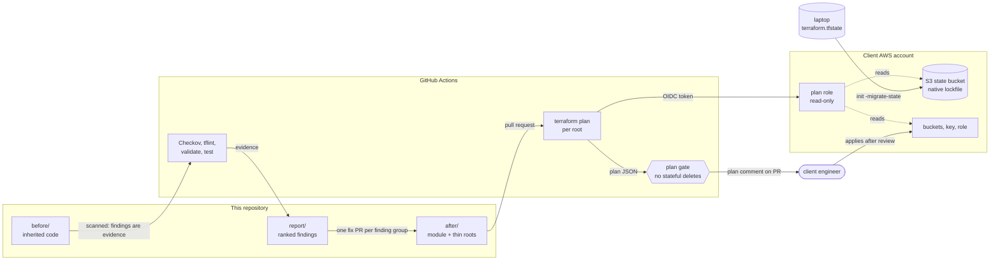

# terraform-aws-rescue-lab

[](https://github.com/gamaware/terraform-aws-rescue-lab/actions/workflows/ci.yml)
[](https://github.com/gamaware/terraform-aws-rescue-lab/actions/workflows/plan.yml)
[](after/envs/prod/versions.tf)
[](LICENSE)

**Terraform diagnostic and repair: read-only checks, ranked findings, fix PRs, and a local-to-S3 state migration
with 0 resources destroyed.**

> **Demonstration repository. The client, "Harbor Goods", is fictional.** Every account ID, bucket name and email
> address is a placeholder. The inherited code in `before/` is insecure on purpose.

| Start here | What it is |
| --- | --- |
| [`report/diagnostic-report.md`](report/diagnostic-report.md) | The deliverable: 10 findings ranked by risk, with evidence, fix, repair order and scope |
| [`before/`](before/) | The inherited codebase: local state, copy-pasted environments, public bucket, `*:*` IAM |
| [`after/`](after/) | The repaired codebase: one tested module, thin environment roots, S3 backend |
| [`migration/`](migration/README.md) | The state migration runbook, with real plan output and rollback |
| [`docs/adr/`](docs/adr/README.md) | Six architecture decision records |

## What this proves

- **Diagnosis without write access.** Findings come from Checkov, tflint and `terraform plan`. In an engagement the
  plans run with a read-only OIDC role; here they run against a local emulator. Nothing in this repository can change
  the client's account ([ADR 0001](docs/adr/0001-read-only-diagnosis.md)).
- **Findings a client can act on.** Each has a file and line, tool output as evidence, the business risk and the fix,
  ranked by risk, followed by a repair order and an explicit out-of-scope list.
- **Refactoring without destroying anything.** Two copy-pasted folders become one module and two thin roots. `moved`,
  `removed` and `import` blocks carry the old state across: the prod plan reads
  `Plan: 1 to import, 12 to add, 7 to change, 0 to destroy.`
- **A state migration you can replay.** Local state moves to S3 with the native lockfile, verified by comparing
  resources before and after. The whole runbook runs against a local AWS emulator in a few minutes.
- **A gate that catches the dangerous plan.** A `jq` check on the plan JSON fails any PR that deletes or replaces a
  bucket or key, including the state bucket. It catches the rename in `before/prod` that would destroy prod data.
- **Before and after, measured.** Checkov: 47 failed checks to 0. tflint: 12 issues to 0. Tests: none to 9.

## How it fits together



**Key:** rectangles are code or jobs, cylinders hold state, the hexagon is a blocking check, the rounded box is a
person. Solid arrows move code, data or approval; dotted arrows are read-only access.

## Repository layout

```text
before/dev, before/prod        inherited roots, local state, kept as received (valid, insecure)
after/bootstrap                state bucket (KMS, versioned, TLS-only), GitHub OIDC provider, read-only plan role
after/modules/app-storage      the module: main.tf, variables.tf (validated), outputs.tf, examples/basic, tests/
after/envs/dev, after/envs/prod  thin roots: S3 backend with use_lockfile, moved.tf, imports.tf (prod)
migration/                     runbook and demo/run-local-demo.sh (moto)
report/                        diagnostic-report.md
scripts/                       check-plan.sh (plan gate) and its fixture tests
docs/adr/                      decision records 0001-0006
.github/workflows/             ci.yml, plan.yml, drift.yml
```

## Run it

### Offline, no AWS account

Needs Terraform 1.10 or later, tflint, Checkov, jq and, for the migration demo, `uv`.

```bash
# The findings
checkov -d before --framework terraform --compact --quiet
tflint --init && tflint --recursive --chdir=before --config="$PWD/.tflint.hcl"

# The repaired code is clean
checkov -d after --config-file .checkov.yaml
tflint --recursive --chdir=after --config="$PWD/.tflint.hcl"
terraform -chdir=after/modules/app-storage init -backend=false && terraform -chdir=after/modules/app-storage test

# The plan gate
scripts/tests/test-check-plan.sh

# The full migration against moto (second terminal for the emulator)
MOTO_IAM_LOAD_MANAGED_POLICIES=true uvx --from 'moto[server,proxy]==5.2.3' moto_proxy -p 5005
migration/demo/run-local-demo.sh
```

### Against a real AWS account

1. Apply `after/bootstrap` with local admin credentials and move its state into the new bucket
   ([runbook step 1](migration/README.md#1-bootstrap-the-state-bucket)).
2. Set repository variables `AWS_PLAN_ROLE_ARN`, `TF_STATE_BUCKET` and `AWS_REGION`
   (for example `arn:aws:iam::YOUR_AWS_ACCOUNT_ID:role/rescue-lab-github-plan`).
3. Open a pull request that touches `after/`. `plan.yml` plans each root with the read-only role, runs the plan gate
   and posts one comment per root.
4. Apply from a workstation or the client's pipeline, following the runbook. This repository has no apply job by
   design.

## CI

| Workflow | Trigger | Blocks merge on |
| --- | --- | --- |
| `ci.yml` | PR, push to `main` | fmt, validate (all roots, including `before/`), `terraform test`, tflint and Checkov on `after/`, plan gate fixtures, actionlint, zizmor |
| `ci.yml` / `before-findings` | PR, push to `main` | Nothing: scans `before/`, uploads Checkov (CLI and JUnit) and tflint reports as the `before-findings` artifact |
| `plan.yml` | PR touching `after/` | Plan errors and the plan gate, per root, with the read-only OIDC role |
| `drift.yml` | Weekly, manual | Fails the run if any root drifted from code |

Actions are pinned by commit SHA, workflows default to `permissions: {}`, checkout does not persist credentials, and
variables reach shell steps through `env`. Checkov is a pinned pip install (3.2.529); the old container action ran an
outdated Checkov that ignored inline skips.

## Cost and teardown

The demo against moto costs nothing. In a real account:

| Resource | Cost |
| --- | --- |
| KMS keys (state, uploads) | About USD 1 per key per month, plus requests (bucket keys keep requests low) |
| S3 buckets (state, uploads, access logs) | Storage and requests, cents for a lab |
| IAM role, OIDC provider | Free |

Tear down in reverse order with admin credentials: `terraform destroy` in `after/envs/dev` (its buckets have
`force_destroy`), then prod after emptying its versioned buckets, then `after/bootstrap` after removing
`prevent_destroy` from the state bucket and moving its state back to local. KMS keys wait 7 days (state) or 30 days
(uploads) before deletion.

## Honest limits

- **One scenario, one account.** Real rescues have more resources, more state files and more surprises. The method
  carries over; the finding list will not.
- **The emulator is not AWS.** moto proves the Terraform mechanics (moves, import, migration, gate) but accepts
  things AWS would reject, and needs one workaround documented in the runbook. The real proof is the PR plan in the
  client's account.
- **Mocked tests.** `terraform test` checks configuration and inputs, not AWS behavior. There is no online test in a
  disposable account.
- **Path-pinned module.** Both environments call the module by relative path, so they always run the same version.
  [ADR 0003](docs/adr/0003-one-module-thin-roots.md) shows the tag-pinned form for staged rollouts.
- **No apply automation.** Intentional for a diagnosis engagement ([ADR 0001](docs/adr/0001-read-only-diagnosis.md)),
  but a long-term client would want an approval-gated apply job.
- **Public images.** Closing F1 stops direct public access; serving images through CloudFront is out of scope.
- **Plans on pull requests.** Anyone with write access can change a workflow in a PR and run code with the plan role.
  The role is read-only and explicitly denied object, parameter and secret reads, and the plan comment masks account
  IDs, but a client with many writers should gate `plan.yml` on a GitHub environment with reviewers.

## Contributing and security

See [CONTRIBUTING.md](CONTRIBUTING.md), [SECURITY.md](SECURITY.md) and [CHANGELOG.md](CHANGELOG.md).

## License

[MIT](LICENSE)
