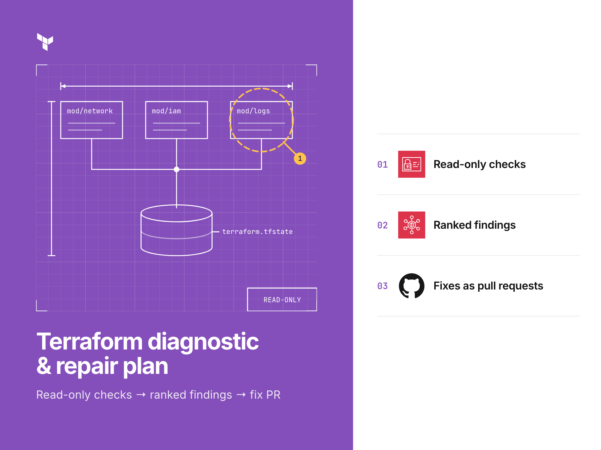
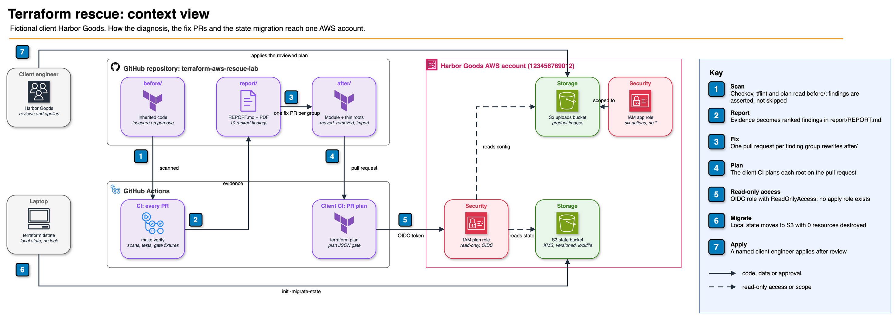

# terraform-aws-rescue-lab

**A Terraform rescue from diagnosis to repair: ranked findings from read-only checks, fix PRs, and a local-to-S3
state migration that destroys 0 resources.**

[](https://github.com/gamaware/terraform-aws-rescue-lab/actions/workflows/ci.yml)
[](LICENSE)




> **Lab with a fictional client.** The client, "Harbor Goods," does not exist. Account `123456789012` serves as the AWS
> documentation placeholder; all bucket names and email addresses are fictional. Security flaws in the inherited
> `before/` code are deliberate.

## What this proves

- **Diagnosis without write access.** Checkov, tflint and `terraform plan` supply the findings. Engagement plans use a
  read-only OIDC role; this lab uses a local emulator. The repository has no capability to modify the client's account
  ([ADR 0001](docs/adr/0001-read-only-diagnosis.md)).
- **Findings a client can act on.** The report assigns severity to 10 findings: 2 critical, 3 high, 4 medium and 1 low.
  For each, it supplies the file and line, supporting tool output, business risk and remedy. A repair sequence and
  explicit scope exclusions follow.
- **Refactoring without destroying anything.** One module with two thin roots replaces two duplicated folders. State
  transfers through `moved`, `removed` and `import` blocks, producing this prod plan:
  `Plan: 1 to import, 12 to add, 7 to change, 0 to destroy.`
- **A gate that catches the dangerous plan.** PRs fail a `jq` check of plan JSON when they delete or replace any bucket
  or key, including the state bucket. The check detects the `before/prod` rename that would destroy production data.
- **Before and after, measured and asserted.** Failed Checkov checks drop from 47 to 0, tflint issues from 12 to 0, and
  tests increase from none to 9. Any change in the Checkov or tflint counts causes `make verify` to fail.

## Inspect the deliverable

| Artifact | What it is |
| --- | --- |
| [`report/REPORT.md`](report/REPORT.md) ([PDF](report/REPORT.pdf)) | The diagnosis: 10 findings ranked by risk, with evidence, fix, repair order and scope |
| [`before/`](before/) | The inherited codebase: local state, copy-pasted environments, public bucket, `*:*` IAM |
| [`after/`](after/) | The repaired codebase: one tested module, thin environment roots, S3 backend |
| [`migration/README.md`](migration/README.md) | The state migration runbook, with real plan output, checkpoints and rollback |
| [`scripts/check-plan.sh`](scripts/check-plan.sh) | The plan gate that blocks deletes and replacements of stateful resources |
| [`examples/workflows/`](examples/workflows/) | Plan-on-PR and weekly drift workflows for the client's CI, with the read-only role |

## Scenario and acceptance criteria

Fictional mid-size retailer Harbor Goods uses S3 for product images, managed through separate `dev` and `prod` Terraform
folders. The folders have diverged, state sits on an engineer's laptop, and no one wants to execute the next `apply`.
The requested audit and repair have three conditions: read-only access during diagnosis, no destruction or recreation in
production, and every change applied by the client's engineers.

Completion requires the following:

| Criterion | How it is checked |
| --- | --- |
| Every finding is ranked and traceable to a file, line and tool output | `make findings` compares the scans with `report/evidence/` and the IDs the report cites |
| The repaired code has no Checkov failures and no tflint issues | `make findings` |
| The module rejects the inputs that caused the findings | `terraform test`: 9 runs, including rejected inputs |
| Prod state moves to S3 with the same resources and attributes | `make demo`, runbook step 4 |
| The full repair plan destroys nothing | `make demo`: `0 to destroy`, plan gate passes |
| A second plan after the apply shows no changes | `make demo`, runbook step 8 |

## Architecture



CI scans the inherited code, supplying all results as report evidence (1, 2). Findings are grouped into separate pull
requests targeting `after/` (3). For each PR, the client's CI assumes a read-only role through GitHub OIDC to run the
plan; the gate rejects stateful deletes (4, 5). Migration transfers the local state file to the new S3 bucket using
`terraform init -migrate-state` (6). A named client engineer then applies each reviewed plan (7). A second diagram,
[`docs/diagrams/state-migration.png`](docs/diagrams/state-migration.png), details each migration step. The adjacent
`.drawio` files contain the diagram sources.

## Verify locally

Verification requires no AWS account. The prerequisites below include the versions used to record the evidence:

| Tool | Version |
| --- | --- |
| Terraform | 1.14.5 (the roots accept 1.11 or later) |
| tflint | 0.61.0, AWS ruleset 0.49.0 (installed by `tflint --init`) |
| Checkov | 3.3.19 (run through `uvx`, Python 3.13) |
| pandoc | 3.11 (the PDF check compares bytes) |
| uv | any recent version; it fetches Typst 0.14.1 for the PDF and moto 5.2.3 for the demo |
| jq, shellcheck, shellharden | any recent version |

```bash
make verify
```

Verification covers tool versions, `terraform fmt`, `validate` across all seven roots, `terraform test`, and assertions
for the findings in `before/` and `after/`. It also checks plan gate fixtures, shell lint and agreement between
`report/REPORT.pdf` and its Markdown source. With providers cached, the run takes roughly a minute and finishes with:

```text
pass  before/ matches report/evidence/before-checkov.txt (47 findings)
pass  before/ matches report/evidence/before-tflint.txt (12 findings)
pass  after/ Checkov: Passed checks: 178, Failed checks: 0, Skipped checks: 21
pass  after/ tflint: 0 issues
...
pass  report/REPORT.pdf matches report/REPORT.md
verify: all checks passed
```

To replay the complete prod migration against moto, `make demo` launches the emulator on localhost, executes
[`migration/demo/run-local-demo.sh`](migration/demo/run-local-demo.sh), then shuts the emulator down. The replay takes a
few minutes.

### Optional live test

In a real AWS account, `make test-live` applies the module and verifies behavior that mocked tests assume: blocked
public access, SSE-KMS, versioning, disabled ACLs and a role policy without wildcards. An exit trap then destroys
everything, followed by a check that no resources tagged `purpose=portfolio-test` remain. Before proceeding, it uses the
`dev` profile to display the account returned by `aws sts get-caller-identity` and requests confirmation. Only the
maintainer runs this test; CI never does. Its output must never be committed. The cost covers two S3 buckets and one KMS
key for a few minutes.

## Repository map

```text
before/dev, before/prod          inherited roots with local state, kept as received (valid, insecure)
after/bootstrap                  state bucket (KMS, versioned, TLS-only), GitHub OIDC provider, read-only plan role
after/modules/app-storage        the module: validated inputs, examples/basic, tests/ (mocked terraform test)
after/envs/dev, after/envs/prod  thin roots: S3 backend with use_lockfile, moved.tf, imports.tf (prod)
migration/                       runbook and demo/run-local-demo.sh (moto)
report/                          REPORT.md, REPORT.pdf (generated), evidence/ (scanner results the report cites)
scripts/                         plan gate, findings assertion, PDF build, demo runner, live test
examples/workflows/              plan.yml and drift.yml for the client's CI
docs/adr/, docs/diagrams/        decision records 0001-0008; diagram sources and exports
```

## Decisions and trade-offs

| ADR | Decision | Status |
| --- | --- | --- |
| [0001](docs/adr/0001-read-only-diagnosis.md) | Diagnose with a read-only role; no apply role in this repo | Accepted |
| [0002](docs/adr/0002-s3-backend-native-lockfile.md) | S3 backend with the native lockfile, no DynamoDB table | Accepted |
| [0003](docs/adr/0003-one-module-thin-roots.md) | One module, thin environment roots | Accepted |
| [0004](docs/adr/0004-declarative-refactoring.md) | Refactor state with moved, removed and import blocks, not CLI commands | Accepted |
| [0005](docs/adr/0005-plan-json-policy-gate.md) | Block plans that delete or replace stateful resources | Accepted |
| [0006](docs/adr/0006-native-terraform-test.md) | Native terraform test with mock_provider instead of Terratest | Accepted |
| [0007](docs/adr/0007-assert-intentional-findings.md) | Assert the intentional findings in before/ instead of skipping them | Accepted |
| [0008](docs/adr/0008-no-cloud-access-in-repo-ci.md) | This repository's CI has no cloud access; AWS-facing workflows ship as examples | Accepted |

## Security and quality gates

| Gate | Where | Why |
| --- | --- | --- |
| `make verify` | CI on every PR and push to `main`, and locally | fmt, validate, tests, asserted findings, plan gate, shell lint, actionlint on both workflow folders, PDF check |
| markdownlint, lychee, Vale | CI (shared `lint-docs` workflow), pre-commit | Docs stay readable and links resolve |
| actionlint, zizmor | CI (shared `lint-actions` workflow), pre-commit | Workflows are valid and hardened |
| gitleaks, detect-secrets | CI (shared `secrets` workflow: gitleaks), pre-commit (both) | No credentials in history or in new commits |
| Semgrep, Trivy, Checkov | CI (shared `security` workflow) | Semgrep and Trivy scan the whole repository, with each intentional finding in `before/` excepted by line or ID and named; Checkov scans `after/` and the workflows, and `make verify` asserts `before/` |
| OSSF Scorecard | Push to `main`, weekly | Supply-chain posture of the repository itself |

Workflows default to `permissions: {}`; each job receives `contents: read`, plus `security-events: write` for the
Scorecard upload. Third-party actions and the shared `gamaware/.github` workflows are pinned by commit SHA. Workflows
under `.github/workflows/` have no ability to request OIDC tokens or access AWS
([ADR 0008](docs/adr/0008-no-cloud-access-in-repo-ci.md)).

## Limits and production adaptations

- **One scenario, one account.** Actual rescues involve additional resources, state files and surprises, so the method
  applies beyond this lab while the findings remain specific to it.
- **The emulator is not AWS.** moto demonstrates Terraform moves, import, migration and the gate. It also permits
  operations AWS would reject and requires a workaround described in the runbook. Proof in the real environment comes
  from the PR plan in the client's account.
- **Mocked tests.** Configuration and inputs are checked by `terraform test`; AWS behavior is outside those checks. The
  disposable `make test-live` run verifies that behavior and requires manual execution.
- **Path-pinned module.** Relative-path module references keep both environments on the same version. For staged
  rollouts, [ADR 0003](docs/adr/0003-one-module-thin-roots.md) provides the tag-pinned alternative.
- **No apply automation.** A diagnosis engagement deliberately leaves applies manual. A client continuing long term
  would want an apply job gated by approval.
- **Public images.** Resolving F1 removes direct public access. Delivering images through CloudFront falls outside
  scope.
- **Plans on pull requests in the client's repository.** Write access allows anyone to edit a workflow in a PR and
  execute code using the plan role. That role has read-only permissions with explicit denials for object, parameter and
  secret reads. Plan comments mask account IDs. Clients with many writers should require GitHub environment reviewers
  for `plan.yml`.
- **Cost and teardown in a real account.** Each KMS key costs about USD 1 per month, and lab S3 buckets cost cents;
  neither the IAM role nor the OIDC provider carries a charge. Reverse the creation order for teardown: first
  `after/envs/dev`, whose buckets use `force_destroy`; next prod, once its versioned buckets are empty; finally
  `after/bootstrap`, after removing the state bucket's `prevent_destroy` and returning its state to local storage.

## Related work

- The [aws-devops-portfolio](https://github.com/gamaware/aws-devops-portfolio) portfolio index links to the
  corresponding Upwork service, "Terraform on AWS audit and fix".
- The method is the one Alex uses in audits for ITESO and freelance clients in Guadalajara. Every finding here comes
  from the fictional code in this repository.
- Shared [gamaware/.github](https://github.com/gamaware/.github) files cover contributions, conduct and support. Use
  [SECURITY.md](SECURITY.md) for security reporting and [CHANGELOG.md](CHANGELOG.md) for changes.

## License

[MIT](LICENSE)
